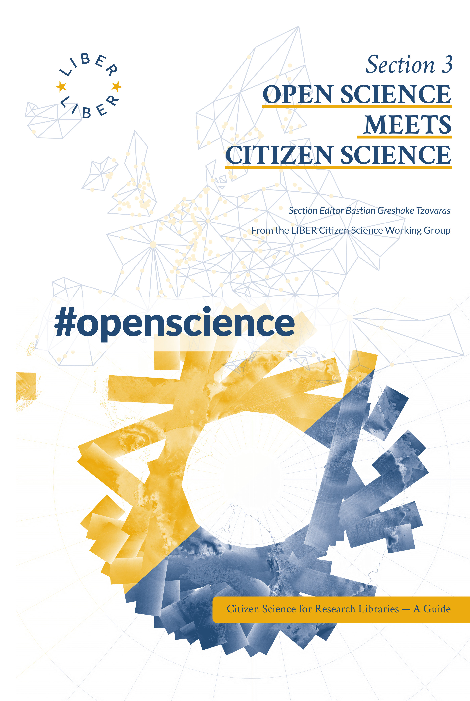

About the Book

      

        <h2>Open Science Meets Citizen Science</h2>
        
Section Editor Bastian Greshake Tzovaras

        
v1.0, 2024

        
Series: Citizen Science for Research Libraries — A Guide

        

        

        
<strong>Co-Editors-in-Chief:</strong> Thomas Kaarsted &amp; Simon Worthington. Correspondence <a href="mailto:simon.worthington@tib.eu">simon.worthington@tib.eu</a>. <strong>Editors:</strong> Alisa Martek and Dragana Janković. <strong>Reviewers:</strong> Dr Raphaëlle Bats, Sara Decoster, Jitka Stilund Hansen, Tiberius Ignat, and Mitja V. Iskrić. 

        
<strong>Editorial Committee:</strong> Paul Ayris (Chair), Bastian Greshake Tzovaras, Jitka Stilund Hansen, and Kirsty Wallis.

        
DOI:<strong> </strong><a href="https://doi.org/10.25815/2tj5-0289">10.25815/2tj5-0289</a> | ISBN Print:<strong> </strong>978-87-94345-90-3 e‑book:<strong> </strong>978-87-94345-91-0 | Wikidata: <a href="https://www.wikidata.org/wiki/Q125808304">Q125808304</a>

        
Web: <a href="https://cs4rl.github.io/open-science">cs4rl.github.io/open-science</a> | Source: <a href="https://github.com/cs4rl/open-science">github.com/cs4rl/open-science</a> | Series: <a href="https://libereurope.eu/working-group/liber-citizen-science-working-group/citizen-science-guide/">libereurope.eu/cs4rl</a> 

        
Published by LIBER Citizen Science Working Group. 

        
Collaborations: SciStarter and ECSA.

        
Copyright © 2024 the authors. Publication, articles, and images licensed under a Creative Commons Attribution Share Alike 4.0 International License – (<a href="https://creativecommons.org/licenses/by-sa/4.0/">CC BY-SA</a>) unless otherwise stated.

        
Multi-format production: #NextGenBooks – Open Science Lab, <a href="https://github.com/TIBHannover/ADA. ">TIB – ADA Publishing Pipeline</a>. CSS template production courtesy Raquel Perez de Eulate, Interpunct Studios – <a href="https://interpunct.dev/">Interpunct.dev</a>. Design based on template design: Geralda van der Es/ SPRESSO.

        
Code – <a href="https://github.com/cs4rl/guide/LICENSE">GNU General Public License v3.0</a>. Data – All data and data sets produced are <a href="https://creativecommons.org/publicdomain/zero/1.0/">CC0</a>, Public Domain.

        
Print and PDF design template (CC BY-SA). Multi-format template (CC BY-SA). Fonts: CrimsonText and Lato, these fonts are licensed under the SIL <a href="https://scripts.sil.org/OFL">Open Font License </a>(OFL). Free and Open Source Software used in production – Fidus Writer (GNU AFFERO GPL), Vivliostyle (GNU AFFERO GPL).

        
Cover image: European Space Agency (ESA), ASAR global monitoring <a href="https://www.esa-photolibrary.com/ESA/media/20377">Mode of the Antarctic</a>. The material is ESA copyright and is supplied to you free of charge on the following <a href="https://www.esa-photolibrary.com/ESA/info2.do">terms and conditions</a>. Find out more about <a href="https://earth.esa.int/eogateway/missions/envisat/descriptionmissions/envisat/description">Envisat here</a>.

      

      

